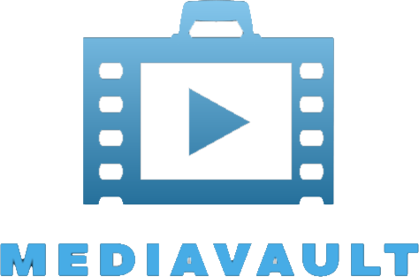

  

---

# Media Vault

**Media Vault** is an application designed to efficiently manage the rentals and returns of media items, including vinyl records, DVDs, video games, and movies. With an intuitive interface and robust features, Media Vault provides users with a seamless experience for keeping track of their media rentals and organizing their collections.

---

## Features

- **User Management**
    - Sign up, log in, and manage user profiles.

- **Media Browsing & Search**
    - Browse media items by category, genre, or title.
    - View detailed information about each item.

- **Rental Management**
    - Rent media items and track due dates.
    - Return media items with ease.
    - Real-time availability updates and notifications for overdue items.

- **Data Storage & History**
    - Maintain user data, media inventory, and rental history.

- **User Interface**
    - A clean and intuitive design powered by **JavaFX** for a smooth user experience.

---

## Technology Stack

- **Programming Language:** Java
- **Integrated Development Environment (IDE):** IntelliJ IDEA
- **Database:** MySQL
- **Graphical User Interface (GUI) Framework:** JavaFX

---

## Outcome

**Media Vault** is designed to be a handy and reliable tool for managing media rentals. Its easy-to-use interface and robust feature set will help users organize their collections, track due dates, and enjoy a smooth rental process.

---